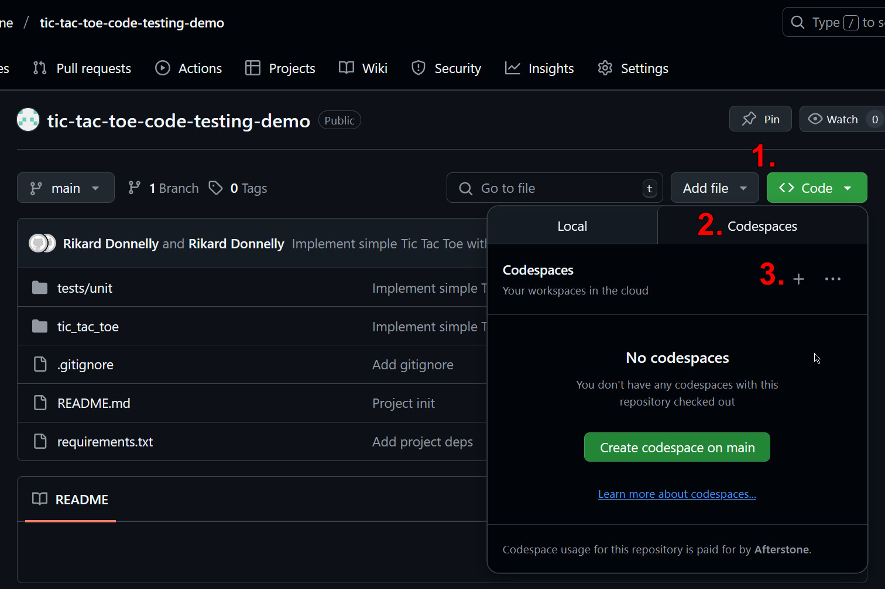
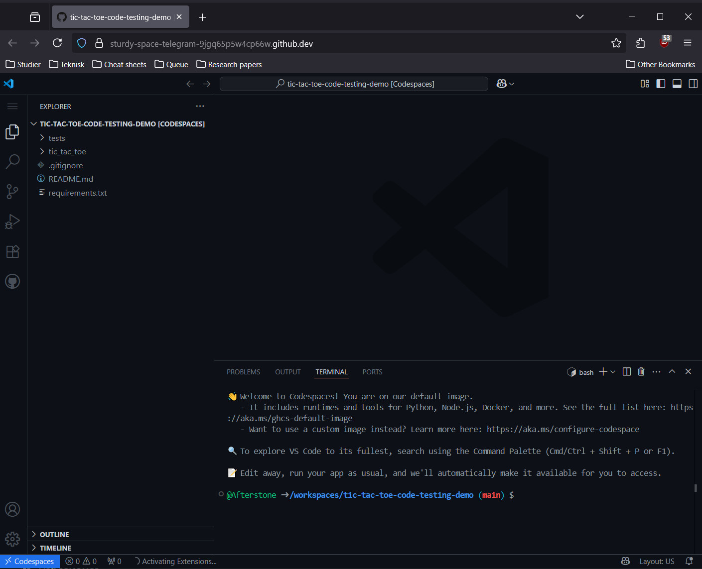
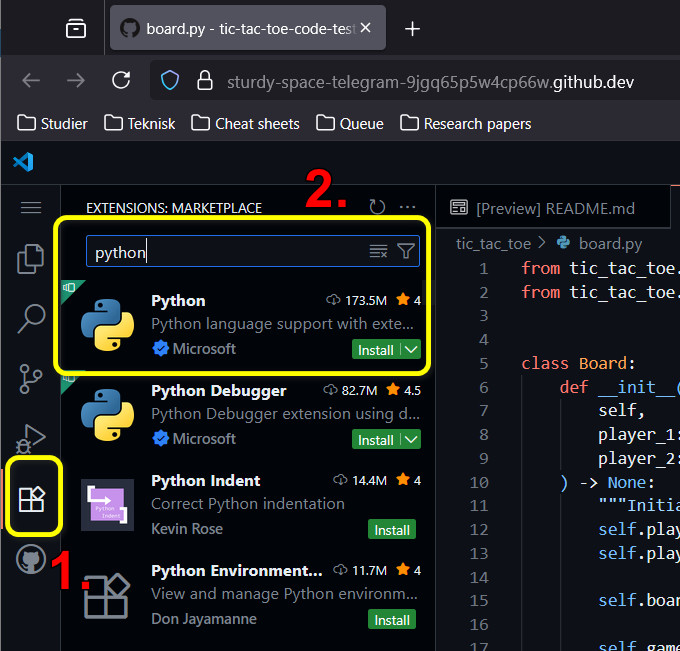
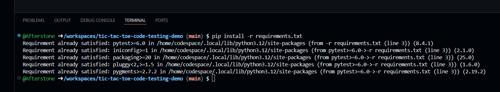
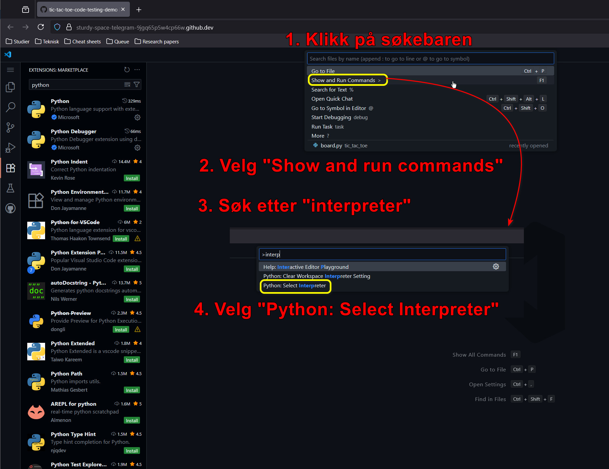
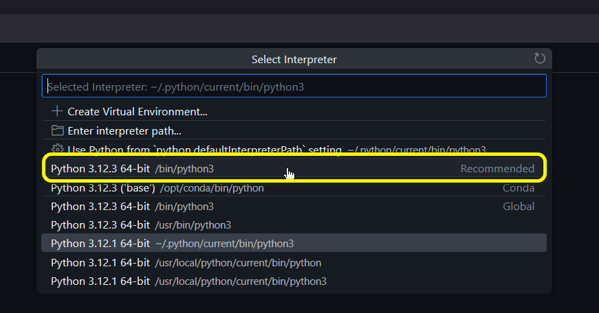
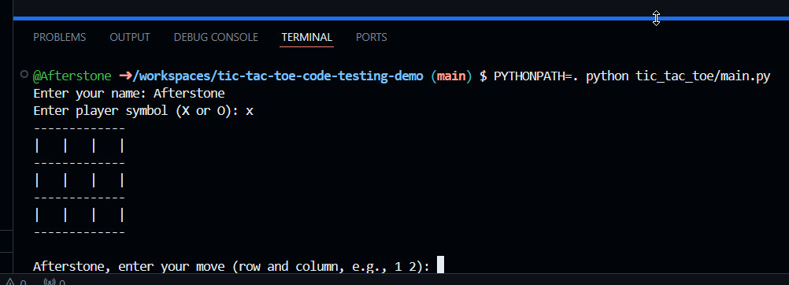
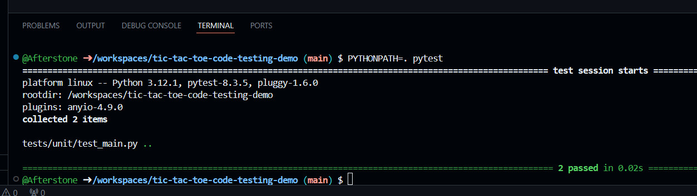

# Kodetesting med bondesjakk som case study

## Oppsett

### 1. Codespaces

Codespaces er et skybasert arbeidsmiljø basert på Visual Studio Code.

I Github må du være logget inn med brukeren din. Da kan du åpne et Codespaces-miljø fra et repo du har navigert til.

**Måte 1:** Trykk punktum-tasten (.), når du ser på repoet. Du skal være her nå.

**Måte 2:** Du kan alternativt åpne et code space via Code-knappen.

Dette skal åpne et Github Codespace i nettleseren din, som på bildet under. 

### 2. Installer Python-utvidelsen i vscode

Naviger til extensions-ikonet, søk etter Python og velg den som matcher bildet under.

### 3. Installere Python-avhengigheter

Codespaces-miljøet kommer ferdig installert med Python, men vi trenger å installere avhengighetene prosjektet bruker.

I terminalen, skriv `pip install -r requirements.txt`.

### 4. Sett opp vscode med riktig Python interpreter

For å få på plass riktige farger, autocomplete osv. må man knytte Python-utvidelsen til Python-installasjonen man ønsker å bruke. Dette er fordi man kan installere flere Python-miljøer ved siden av hverandre, f.eks. versjon 3.11 og 3.12.

## Kjøre koden

Du skal nå kunne kjøre koden ved å skrive `PYTHONPATH=. python tic_tac_toe/main.py` i terminalen.

Testene kan kjøres ved å skrive `PYTHONPATH=. pytest`.

For de som lurer: Vi skriver `PYTHONPATH=.` i dette prosjektet for å være sikre på at vi kan importere kode fra andre filer i prosjektet.
